# 校园社团管理系统 - Campus Club Management System

> 项目愿景：打造一个现代化、高效、易用的校园社团管理平台，服务学生、社团管理员和系统管理员三方用户。

## 架构总览

本项目是一个基于 Vue 3 + Element Plus 的单页应用（SPA），采用前后端分离架构设计。前端专注于用户界面交互与数据展示，通过 RESTful API 与后端服务通信。

### 技术栈选型

- **核心框架**: Vue 3.5.24 (Composition API)
- **UI 组件库**: Element Plus 2.12.0
- **状态管理**: Pinia 3.0.4
- **路由管理**: Vue Router 4.6.4
- **构建工具**: Vite 7.2.4
- **HTTP 客户端**: Axios 1.13.2
- **数据可视化**: ECharts 6.0.0 + ECharts WordCloud
- **样式方案**: SCSS + Tailwind CSS

### 核心特性

1. **响应式设计**: 完美适配桌面端与移动端
2. **权限管理**: 基于 RBAC 的三级权限体系（学生/社团管理员/系统管理员）
3. **数据可视化**: 集成热力图、雷达图、漏斗图、仪表盘等多种图表
4. **状态持久化**: 关键数据本地存储，提升用户体验
5. **自动化配置**: 组件自动导入，API 自动引入

## 模块结构图

```mermaid
graph TD
    A["(根) 校园社团管理系统"] --> B["src/api"];
    A --> C["src/views"];
    A --> D["src/components"];
    A --> E["src/stores"];
    A --> F["src/utils"];
    A --> G["src/styles"];

    B --> B1["activity.js"];
    B --> B2["admin.js"];
    B --> B3["club.js"];
    B --> B4["user.js"];
    B --> B5["clubAdmin.js"];

    C --> C1["common"];
    C --> C2["admin"];
    C --> C3["club-admin"];

    C1 --> C11["Login.vue"];
    C1 --> C12["Layout.vue"];
    C1 --> C13["Dashboard.vue"];

    C2 --> C21["ClubManage.vue"];
    C2 --> C22["ActivityAudit.vue"];

    C3 --> C31["ClubInfo.vue"];
    C3 --> C32["MemberManage.vue"];
    C3 --> C33["ActivityManage.vue"];

    D --> D1["charts"];
    D1 --> D11["CalendarHeatmap.vue"];
    D1 --> D12["RadarChart.vue"];
    D1 --> D13["FunnelChart.vue"];
    D1 --> D14["GaugeChart.vue"];

    E --> E1["user.js"];

    F --> F1["auth.js"];
    F --> F2["request.js"];

    G --> G1["variables.scss"];
    G --> G2["element-custom.css"];
```



## 模块索引

| 模块路径 | 职责描述 | 技术栈 |
|---------|---------|--------|
| src/views/common | 公共页面模块 | Vue 3 + Element Plus |
| src/views/admin | 系统管理员模块 | Vue 3 + Element Plus |
| src/views/club-admin | 社团管理员模块 | Vue 3 + Element Plus |
| src/components/charts | 图表组件库 | ECharts + Vue 3 |
| src/api | API 接口层 | Axios |
| src/stores | 状态管理 | Pinia |
| src/utils | 工具函数 | JavaScript |
| src/styles | 样式系统 | SCSS + Tailwind CSS |

## 运行与开发

### 环境要求
- Node.js >= 16.0.0
- npm >= 7.0.0 或 yarn >= 1.22.0

### 开发命令
```bash
# 安装依赖
npm install

# 启动开发服务器（端口 3000）
npm run dev

# 构建生产版本
npm run build

# 预览生产构建
npm run preview
```

### 开发代理配置
开发环境已配置 API 代理，自动将 `/api` 请求转发到 `http://localhost:8080`

## 测试策略

当前项目尚未配置测试框架。建议后续添加：
- **单元测试**: Vitest + Vue Test Utils
- **端到端测试**: Cypress 或 Playwright
- **组件测试**: Vue Test Utils

## 编码规范

1. **代码风格**: 遵循 Vue 3 官方风格指南
2. **组件命名**: PascalCase
3. **文件组织**: 按功能模块分组
4. **API 命名**: camelCase
5. **CSS 命名**: BEM 规范（可选）

## AI 使用指引

1. **组件开发**: 优先使用 Composition API 和 `<script setup>` 语法
2. **状态管理**: 使用 Pinia 替代 Vuex
3. **样式编写**: 使用 SCSS 预处理器，复用 variables.scss 中的变量
4. **图表开发**: 基于 ECharts，优先使用 components/charts 中的封装组件
5. **权限控制**: 路由守卫已实现，新增页面需配置 meta.roles

## 变更记录 (Changelog)

### 2025-12-13 12:04:45
- 初始化项目文档
- 完成架构分析
- 生成模块索引
- 建立开发规范

## 下一步建议

1. **补充测试框架**: 集成 Vitest 和 Vue Test Utils
2. **TypeScript 迁移**: 逐步引入 TypeScript 增强类型安全
3. **性能优化**:
   - 实现路由懒加载
   - 组件按需引入
   - 图片资源优化
4. **功能扩展**:
   - 添加实时通知系统
   - 集成富文本编辑器
   - 支持文件上传下载
5. **文档完善**:
   - 添加 API 文档
   - 编写组件使用示例
   - 补充部署指南